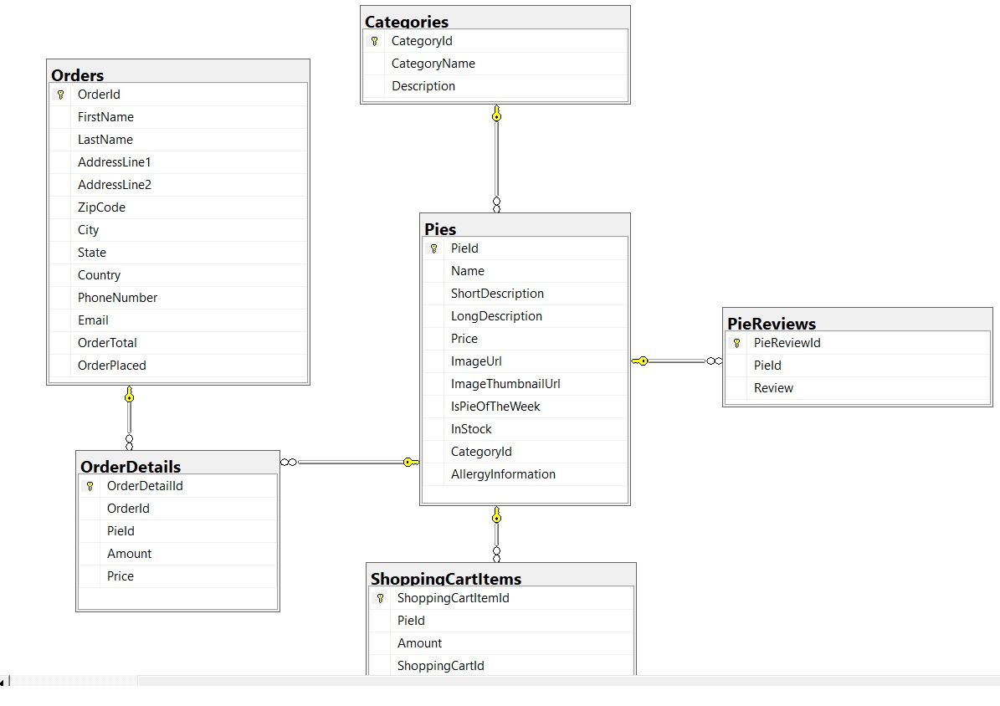

# Cakeshop_Managment_System
An online cake shop using  ASP.NET MVC CORE 3.0 

Cakeshop management system developed with asp.net core 3.1 MVC web application. It keeps track of all the transactions of different categories of cakes. Moreover, allows users to register and login in order to perform transactions. The administrator can create user roles. The application is deployed to azure for demo purpos

## Live Demo

https://onlinecakeshop.azurewebsites.net/ 

## Desktop, Tablet, Mobile

## Database Schema

## Built With

- ASP.NET CORE MVC
- C#
- CSS
- Bootstrap
- jQuery
- JavaScript

## Live Demo

https://onlinecakeshop.azurewebsites.net/ 

## Author

👤 **Tedros Tesfay**

- Github: [tta2yta](https://github.com/tta2yta)
- Email: tta2yta@gmail.com

👤

## 🤝 Contributing

Contributions, issues and feature requests are welcome!

Feel free to check the <a href="https://github.com/tta2yta/Cakeshop_Managment_System/issues" target="_blank">issues page</a>.

## Show your support

Give a ⭐️ if you like this project!

## Acknowledgments
- Gill Clereen  Twitter @gillclereen
- https://docs.microsoft.com/en-us/aspnet/core/data/ef-rp/intro?view=aspnetcore-3.1&tabs=visual-studio
- https://docs.microsoft.com/en-us/aspnet/core/data/ef-mvc/intro?view=aspnetcore-3.1
- https://docs.microsoft.com/en-us/aspnet/core/security/authentication/identity?view=aspnetcore-3.1&tabs=visual-studio
- https://www.stackoverflow.com/
